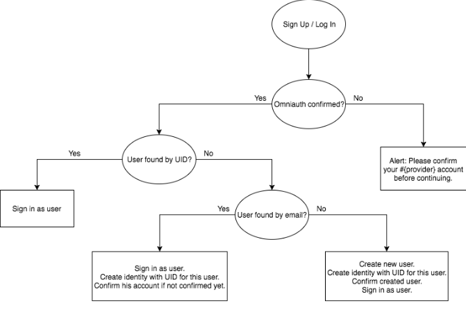

Authentication via Social Networks



```ruby
# Gemfile
...
gem "omniauth-facebook"
gem "omniauth-google-oauth2"
...
```

```ruby
# db/migrate/20160531141911_create_identities.rb
class CreateIdentities < ActiveRecord::Migration[5.1]
  def change
    create_table :identities do |t|
      t.string :provider, null: false
      t.string :uid, null: false

      t.references :user, index: true, foreign_key: true
    end

    add_index(:identities, [:provider, :uid], unique: true)
  end
end
```

```ruby
# app/models/identity.rb
class Identity < ApplicationRecord
  belongs_to :user

  validates :provider, :uid, presence: true
  validates :uid, uniqueness: { scope: :provider }
end
```

```ruby
# config/initializers/devise.rb
...
config.omniauth :facebook, ENV.fetch("FACEBOOK_ID"), ENV.fetch("FACEBOOK_SECRET")
config.omniauth :google_oauth2, ENV.fetch("GOOGLE_ID"), ENV.fetch("GOOGLE_SECRET")
...
```

```ruby
# config/routes.rb
...
devise_for :users, controllers: { registrations: "users/registrations", omniauth_callbacks: "omniauth_callbacks" }
...
```

```ruby
# app/models/user.rb
...
OMNIAUTH_PROVIDERS = %i[
  facebook
  google_oauth2
].freeze

devise :omniauthable, omniauth_providers: OMNIAUTH_PROVIDERS

has_many :identities, dependent: :destroy
...
```

```ruby
# app/controllers/omniauth_callbacks_controller.rb
class OmniauthCallbacksController < ApplicationController
  def facebook
    authenticate_user
  end

  def google_oauth2
    authenticate_user
  end

  def failure
    redirect_to root_path, alert: I18n.t("flash.omniauth.error")
  end

  private

  def authenticate_user
    result = AuthenticateUser.call(omniauth_data: omniauth_data)

    if result.success?
      sign_in_and_redirect(result.user)
    else
      redirect_to(root_path, alert: result.message)
    end
  end

  def omniauth_data
    request.env["omniauth.auth"]
  end
end
```

```ruby
# app/interactors/authenticate_user.rb
class AuthenticateUser
  include Interactor::Organizer

  organize VerifyAuthData, FindOrCreateUser, ConfirmUser, ConnectIdentity
end
```

```ruby
# app/interactors/verify_auth_data.rb
class VerifyAuthData
  include Interactor

  delegate :omniauth_data, to: :context
  delegate :provider, to: :omniauth_data

  def call
    context.fail!(message: I18n.t("flash.omniauth.verification_error")) unless omniauth_confirmed?
  end

  private

  def omniauth_confirmed?
    send("#{provider}_verified?")
  end

  def google_oauth2_verified?
    omniauth_data.extra.raw_info.email_verified
  end

  def facebook_verified?
    omniauth_data.extra.raw_info.verified
  end
end
```

```ruby
# app/interactors/find_or_create_user.rb
class FindOrCreateUser
  include Interactor

  delegate :omniauth_data, to: :context
  delegate :provider, :uid, :info, to: :omniauth_data
  delegate :email, to: :info

  def call
    context.user = find_user_by_identity || find_user_by_email || create_user
  end

  private

  def find_user_by_identity
    Identity.find_by(provider: provider, uid: uid)&.user
  end

  def find_user_by_email
    User.find_by(email: email)
  end

  def create_user
    User.create!(create_attributes)
  end

  def create_attributes
    {
      email: email,
      password: Devise.friendly_token(20),
      confirmed_at: Time.current
    }
  end
end
```

```ruby
# app/interactors/confirm_user.rb
class ConfirmUser
  include Interactor

  delegate :user, to: :context

  def call
    user.confirm unless user.confirmed?
  end
end
```

```ruby
# app/interactors/connect_identity.rb
class ConnectIdentity
  include Interactor

  # Specify, which attributes you want to update from AuthData
  OMNIAUTH_ATTRIBUTES = %i[
    name
  ].freeze

  delegate :user, :omniauth_data, to: :context
  delegate :provider, :uid, :info, to: :omniauth_data

  def call
    Identity.find_or_create_by(identity_params)

    update_user_profile
  end

  private

  def identity_params
    {
      provider: provider,
      uid: uid,
      user: user
    }
  end

  def update_user_profile
    OMNIAUTH_ATTRIBUTES.each do |attribute|
      value = info.public_send(attribute)

      user[attribute] = value if value.present?
    end

    user.save
  end
end
```

Testing

```ruby
# spec/factories/identity.rb
FactoryGirl.define do
  factory :identity do
    provider "google_oauth2"
    uid "123456"

    user
  end
end
```

```ruby
# spec/factories/omniauth.rb
FactoryGirl.define do
  factory :google, class: OmniAuth::AuthHash do
    uid "123545"
    provider "google_oauth2"
     info do
      {
        email: "test@test.ru",
        name: "Test Name"
      }
    end

    trait :verified do
      extra do
        {
          raw_info:
            {
              email_verified: true
            }
        }
      end
    end

    trait :not_verified do
      extra do
        {
          raw_info:
            {
              email_verified: false
            }
        }
      end
    end
  end
end
```

```ruby
# spec/support/omniauth.rb
OmniAuth.config.test_mode = true

OmniAuth.config.mock_auth[:google_oauth2] = OmniAuth::AuthHash.new(
  provider: "google_oauth2",
  uid: "123545",
  info: {
    email: "test@gmail.com",
    name: "Jonny Donny"
  },
  extra: {
    raw_info: {
      email_verified: true
    }
  }
)

OmniAuth.config.mock_auth[:facebook] = OmniAuth::AuthHash.new(
  provider: "facebook",
  uid: "123545",
  info: {
    email: "test@facebook.com",
    name: "Kevin Black"
  },
  extra: {
    raw_info: {
      verified: true
    }
  }
)
```

```ruby
# spec/features/visitor/sign_in_with_social_profile_spec.rb
require "rails_helper"

feature "Sign In with Social Profile" do
  scenario "visitor signs in with google account" do
    visit new_user_session_path

    click_link "Sign in with Google Oauth2"

    expect(page).to have_content("Sign out")
    expect(page).to have_content("Jonny Donny")
  end

  scenario "visitor signs in with facebook account" do
    visit new_user_session_path

    click_link "Sign in with Facebook"

    expect(page).to have_content("Sign out")
    expect(page).to have_content("Kevin Black")
  end
end
```

```ruby
# spec/interactors/verify_auth_data_spec.rb
require "rails_helper"

describe VerifyAuthData do
  let(:omniauth_data) { build :google, :verified }

  describe "#call" do
    subject(:interactor) { described_class.new(omniauth_data: omniauth_data) }

    let(:context) { interactor.context }

    it_behaves_like "success interactor"

    context "when omniauth data is NOT verified" do
      let(:omniauth_data) { build :google, :not_verified }

      it_behaves_like "failure interactor"
    end
  end
end
```

```ruby
# spec/interactors/find_or_create_user_spec.rb
require "rails_helper"

describe FindOrCreateUser do
  let(:user) { create :user }
  let(:user_stub) { double :context, user: user }
  let(:omniauth_data) { build :google, uid: "123", provider: "facebook", info: { email: "test@test.ru" } }

  describe "#call" do
    subject(:interactor) { described_class.new(omniauth_data: omniauth_data) }

    let(:context) { interactor.context }

    it "sets up created user" do
      expect { interactor.run }.to change(User, :count).by(1)

      expect(context.user.email).to eq "test@test.ru"
    end

    context "when user was found by E-mail" do
      let!(:user) { create :user, email: "test@test.ru" }

      it "sets up found user" do
        interactor.run

        expect(context.user).to eq user
      end
    end

    context "when user was found by identity" do
      let(:user) { create :user, email: "test@test.ru" }
      let!(:identity) { create :identity, uid: "123", provider: "facebook", user: user }

      it "sets up found user" do
        interactor.run

        expect(context.user).to eq user
      end
    end
  end
end
```

```ruby
# spec/interactors/confirm_user_spec.rb
require "rails_helper"

describe ConfirmUser do
  let(:user) { create :user, confirmed_at: nil }

  describe "#call" do
    subject(:interactor) { described_class.new(user: user) }

    let(:context) { interactor.context }

    it "confirms user" do
      interactor.run

      expect(user).to be_confirmed
    end

    context "when user is already confirmed" do
      let(:user) { create :user, confirmed_at: confirmed_at_time }
      let(:confirmed_at_time) { DateTime.new(2017, 1, 1, 12, 0, 0, 0) }

      it "confirms user" do
        interactor.run

        expect(user.confirmed_at).to eq confirmed_at_time
      end
    end
  end
end
```

```ruby
# spec/interactors/connect_identity_spec.rb
require "rails_helper"

describe ConnectIdentity do
  let(:omniauth_data) { build :google, uid: "123", provider: "google_oauth2", info: { name: "Test User" } }
  let(:user) { create :user, name: nil }

  describe "#call" do
    subject(:interactor) { described_class.new(user: user, omniauth_data: omniauth_data) }

    let(:context) { interactor.context }

    it "creates an identity for user" do
      expect { interactor.run }.to change(Identity, :count).by(1)
    end

    it "updates user profile" do
      interactor.run

      expect(user.name).to eq "Test User"
    end
  end
end
```
